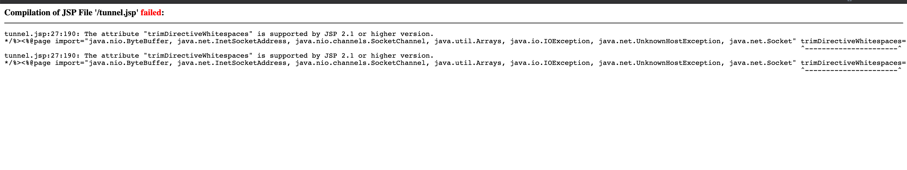
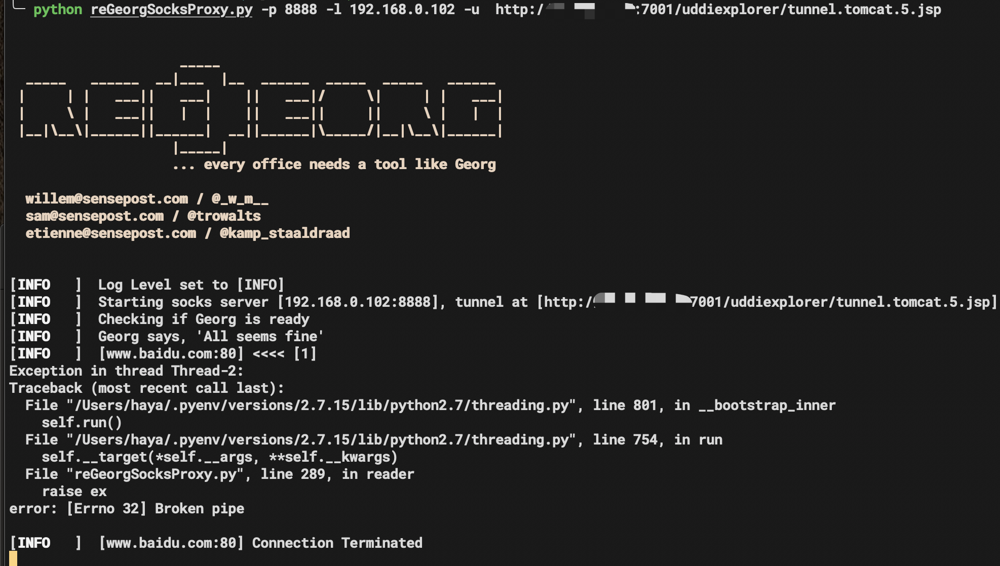
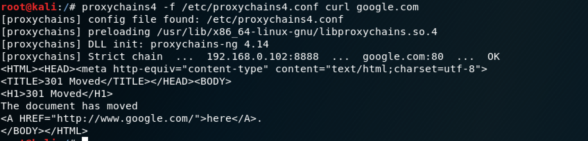

#### reGeorg的特殊版本，适用于老版本weblogic。

正常版本请参考[Neo-reGeorg](https://github.com/L-codes/Neo-reGeorg)或[reGeorg]()(https://github.com/sensepost/reGeorg)

[English](README-en.md)

测试环境：

docker image：victorrenato/weblogic1036

使用原版会提示如下错误：






通过修改reGeorgSocksProxy.py，使其支持老版本weblogic。

```
python reGeorgSocksProxy_trim.py -p 8888 -l 127.0.0.1 -u http://site.com:7001/tunnelnotrim.jsp
```




